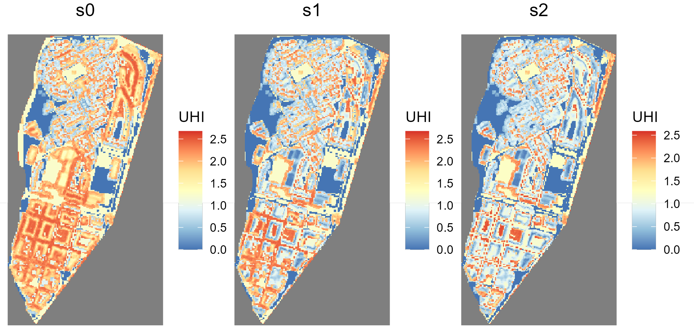

1.  Catalan Institute for Water Research
2.  University of Girona
3.  LEQUIA, University of Girona

 \* [jpueyo\@icra.cat](mailto:jpueyo@icra.cat){.email}

```{r setup, include=FALSE}

# # This project uses {renv} for reproducibility. To install all dependencies in the proper version:
# renv::restore()

knitr::opts_chunk$set(echo = FALSE)
library(ggplot2)
library(dplyr)
library(ediblecity)
library(knitr)
library(sf)
library(purrr)
library(tidyr)
library(patchwork)
library(citr)

set.seed(1121)

options(digits = 2)

refs <- c(
"Table" = 0,
"Figure" = 0,
"Code snippet" = 0  
)

cross_refs <- list()

ref <- function(ref, label = "null"){
  if(!(ref %in% names(refs))) rlang::abort(paste(ref, "is not in refs"))
  refs[[ref]] <<- refs[[ref]] + 1
  cross_refs[[label]] <<- paste(ref, refs[[ref]])
  paste(ref, refs[[ref]])
}

```

## Abstract {.unnumbered}

Urban agriculture is gaining attraction as one of the pillars of the urban ecological transition and to increase food security in an urbanized planet. However, there is a lack of systematic quantification of the benefits provided by urban agriculture solutions. In this paper, we present an R package to estimate multiple benefits of urban agriculture. The goal is to provide a tool that help decision-makers to strategically implement urban agriculture solutions. It provides functions to calculate 8 indicators: urban heat island, runoff prevention, green areas accessibility, NO~2~ sequestration, jobs created in commercial gardens, volunteers involved in community gardens, green per capita and, finally, food production. Moreover, the package also provides a function to create new scenarios. We illustrate the use of the package by comparing three scenarios in a neighborhood of Girona (Spain). Using the data that is provided with the package as example data sets, we compare scenarios with an increasing amount of urban agriculture solutions. The `ediblecity` package is open-source software. This allows other R developers to contribute to the package providing new functionalities or improving the existing ones.

**Keywords:** edible city solutions; urban farming; urban food; nature-based solutions; Rstats; urban challenges; societal challenges; urban agriculture

# Introduction

Urban agriculture is gaining attraction as one of the pillars of the urban ecological transition [@Saumel2019]. Likewise, urban agriculture might have a key role ensuring food security in an urbanized planet [@Barthel2015]. As a consequence, some research has paid attention on the actual or potential food production of urban agriculture [@Grafius2020; @Richardson2016]. However, some others authors argued that the importance of urban agriculture does not reside in their ability to produce food but in the social benefits it provides, such as public health [@Soga2017] and social cohesion [@Saumel2019]. Moreover, other authors stated that urban agriculture can provide environmental benefits as well, such climate regulation [@Clinton2018] or water runoff prevention [@Gittleman2017].

However, there is a lack of systematic quantification of the benefits provided by urban agriculture [@LANGEMEYER2021104055]. For instance, there is no clear evidence to what extent urban agriculture could contribute to reduce the urban heat island [@Lin2015] or to a greener economy [@Saumel2019]. However, most studies have been focused on a single initiative and one benefit [@Artmann2018].

Therefore, decision-makers, who are responsible of leading the urban transitions to more sustainable and resilient cities, are orphan of evidence in how to implement urban agriculture to maximize its impact on sustainability. Yet, several studies provided some insights that can guide the implementation of urban agriculture. For instance, some models assist planners in rainwater harvesting [@Gittleman2017; @Lupia2017]. Broader, @GomezVillarino2021 developed guidelines to maximize ecosystem services through urban agriculture. And, as expected, many models have been developed to quantify food production and food security provided by urban agriculture [@Grafius2020; @Grewal2012; @Hsieh2017; @MacRae2010].

Hence, our goal is to provide a tool to estimate multiple benefits of urban agriculture that help decision-makers to strategically implement urban agriculture solutions. We developed the estimations for eight indicators and a functionality to create scenarios of urban agriculture based on the proportion of elements to be transformed to urban agriculture and on which elements will be transformed and packed all of them in an R package called `ediblecity`. In the methods, we present the main functionalities of the package and then we apply those to an example in a neighborhood of Girona (Spain).

# Methods

## Implementation

all the equations and algorithms to model the benefits of urban agriculture were encapsulated in an `R` package [@RCoreTeam2022], using one function for each indicator and one function to create new scenarios. The package was created using R version 4.2.1 [@RCoreTeam2022] in RStudio desktop v. 2022.07.02. The package structure was assisted by the package `devtools` [@devtools2022] and guided by @Wickham2022. Likewise, the documentation of the functions was assisted by the package `roxygen2` [@roxygen2022]. The dependencies of the package are:

- dplyr (>= 1.0.6) [@dplyr2022]
- magrittr (>= 2.0.1) [@magrittr2022]
- sf (>=0.9) [@sf2018]
- stars (>= 0.5) [@stars2022]
- rlang (>= 1.0) [@rlang2022]

### Urban representation of the city of interest

The `ediblecity` package provide 8 functions to estimate 8 different indicators and a function to create scenarios. It takes as a basis a spatial representation of a city (or a part of a city) as a GIS layer. This representation must have one attribute indicating the land uses of the city (aka functions), such as gardens, streets, rooftops, etc. Some indicators require specific information to be included in the representation. These is explained in each indicator's section.

```{r}
color_names <- sort(unique(city_example$Function))
colors <- c("Brown", "Lightgreen", "chartreuse4", "Grey20", 
            "Black", "chocolate2", "Yellow", "Lightblue",
            "Red", "Grey50", "Darkgreen", "Yellow"
            )
names(colors) <- color_names

theme_set(theme_classic())

city_example |> 
  ggplot()+
  geom_sf(aes(fill=Function), color="white", linewidth = 0.1)+
  scale_fill_manual(values = colors)+
  theme(axis.text.x = element_text(angle=90, hjust=1, vjust=0.5),
        axis.text = element_text(size=6))

```

`r ref("Figure", "urban_representation")`: The urban representation included in the `ediblecity` package as example.


The package includes the representation of Sant Narcís, a neighbourhood of Girona (Spain) as an example of an urban representation (`r cross_refs[["urban_representation"]]`). This example can help the users to create the representation of their cities of interest. In the table below, a sample with one element of each type is shown. The representation is provided as an `sf` object, which is a class for spatial data in R implemented by package `sf` [@Pebesma2018]

`r ref("Table", "structure")`: Structure of the urban representation example"

```{r}
tribble(
  ~Column, ~Description,
  "Function", "A category representing the urban elements",
  "Function_verbose", "A more detailed category for the element, for example, if it is residential",
  "floors", "The number of floors of the element, 0 for non-built",
  "area", "The surface of the element",
  "flat_area", "The surface of the element that is flat (slope < 5º)",
  "edible_area", "The surface that is used to grow edible plants. Only applicable to urban agriculture solutions"
) |> 
  kable()

```

Along with the example for a urban representation, the `ediblecity` package also includes a `data.frame` with the general attributes of each green typology in the urban representation used to estimate the indicators (`r ref("Table", "city_functions")`). However, the user can provide their own attributes to estimate any indicator. In `city_functions` there are other columns not shown in table `r cross_refs[["city_functions"]]`, they are logical variables (i.e. TRUE/FALSE) used internally by the package to select urban agriculture elements.

`pGreen` is the proportion of green of the urban element. In urban agriculture solutions, this is overriden by the attribute `edible_area`. The following attributes come in pairs. This is to consider uncertainty in the estimations. The functions use a random value within the range provided by the pair of values for each element in the city. `no2_seq` is the capacity of the element to capture NO~2~ in gr/s. `food` is the food productivity in kg/m^2^ and `CN` is their curve number, used to calculate infiltration rates [@Cronshey1985].

`r cross_refs[["city_functions"]]`: General attributes of the elements of urban green used to estimate the indicators.

```{r}

city_functions |>
  select(-starts_with("...")) |> 
  select(-edible, -public, -jobs, -volunteers, -location) |>
  select(-starts_with("water")) |> 
  kable()
```
### Indicators estimated

#### Urban heat island

The urban heat island is a measure of how urban agriculture can contribute to climate change adaptation [@Langemeyer2021]. The indicator follows the equation developed by @Theeuwes2017, which was validated in 14 cities. It calculates the difference in air temperature between the urban street canyon and the rural environment. To calculate this indicator, the user must provide a raster representing the sky view factor (SVF). SAGA, a collection of open-source algorithms for geocomputation, provides an algorithm to calculate this [@Conrad2008].

\begin{align}
UHI = \frac{1}{N}\sum_{i=1}^{N}{(2 - SVF_i - Fveg_i) \times \sqrt[4]{\frac{\frac{Q_ql}{C_air \times P_air} \times \Delta{T^3}}{U}}}
\end{align}

where $Fveg$ is the percentage of vegetation in cell $i$; $Q_ql$ is the daily average global radiation; $C_air$ is the air heat capacity; $P_air$ is air density; $\Delta{T}$ is the difference between the maximum and minimum daily average temperatures; and $U$ is the daily average wind speed.

The indicator to estimate the urban heat island is implemented by the package under the function `UHI`. The user must provide the urban representation (`x`) and the raster with SVF values (`SVF`). The `green_df` argument is a `data.frame` with the proportion of green of each `Function` in the urban representation. All the meteorological arguments are provided by default, based on the example provided (Mediterranean climate). However, the user can override them to provide values of their city of interest.

The function returns by default a summary of statistics of the UHI in `x`. If the argument `return_raster` is set to `TRUE`, the function returns a raster as `stars` object [@Pebesma2021] with the UHI values. If `verbose` is set to `TRUE`, then the function returns a vector (i.e. an array) with the UHI in each cell. Both use the same resolution than `SVF`.

`r ref("Code snippet", "uhi")`: Function and arguments to estimate urban heat island.

```{r uhi_demo, echo=TRUE, eval=FALSE}

UHI(
  x,
  SVF,
  green_df = NULL,
  Qql = 6.11,
  Cair = 1007,
  Pair = 1.14,
  Tmax = 30.8,
  Tmin = 20,
  windspeed = 2.77,
  return_raster = FALSE,
  verbose = FALSE
)

```

#### Runoff prevention

Surface runoff is the flow of water occurring on the ground surface when excess rainwater can no longer sufficiently rapidly infiltrate in the soil. Hence, runoff mitigation contributes to climate resilience since rain events will increase due to climate change [@Shukla2019]. The indicator measures the runoff in the city after a specific 24-hours rain event as well as the amount of rainwater harvested by harvesting systems. We departed from the model developed by the Soil Conservation Service (USDA), known as SCS runoff curve number method [@Cronshey1985].

\begin{align}
Q = \frac{(P - I_a)^2}{(P - I_a) + S}
\end{align}

where $P$ is the rainfall volume in mm; $I_a$ is the initial abstraction (all losses before runoff begins); and $S$ is the potential soil moisture retention, which is a function of the curve number. The SCS generalizes $I_a$ as $0.2SS$, we modified this generalization to include the rainwater harvested:

\begin{align}
I_a = 0.2S + \sum_{i=1}^{N}{min\{Rh, Ws\}_i}
\end{align}

where $Rh$ is the potnetial water harvested by the element $i$, calculated as the amount of water fallen on the surface of adjacent higher buildings that are not used for gardening (in litres); $Ws$ is the water storage capacity of the element $i$ in terms of tank volume (imn litres). From both, the minimum is used to calculate $I_a$.

The `runoff_prev` function estimates the runoff as well as the total rainfall in `x` and the total rainwater harvested. Along with the urban representation (`x`), the user must provide a `data.frame` with the functions, two columns representing the range of curve numbers and a logical column indicating if the element has potential to harvest rainwater. The argument `rain` allows to set the rain event (in mm). The curve number of each element is randomized within this range. If `runoff_df` is not provided, `city_functions` is used instead. Following, `floors_field` is the name of attribute in `x` that specifies the number of floors of each element; `harvest_dist` is the maximum distance to consider that a building is adjacent to the element; and `tank_size` is a range for the volume of the rainwater tank (in m^3^). The volume of each tank in the city is randomized within this range.

`r ref("Code snippet", "runoff")`: Function and arguments to estimate runoff prevention
```{r runoff_demo, eval=FALSE, echo=TRUE}

runoff_prev(
  x,
  runoff_df = NULL,
  rain = 85,
  floors_field = "floors",
  harvest_dist = 10,
  tank_size = c(0, 45)
)
```

#### Green areas accessibility

This indicator calculates the distance from each home to the closest public green area and return a summary of statistics. It includes the possibility to exclude areas smaller than a threshold. The function to calculate these distances is `green_distance`. It requires, as usual, the urban representation (`x`) and a vector with all the categories considered public green areas. If it is not provided, the function uses the categories from `city_functions` where the attribute `public` is `TRUE`. The argument `residence_col` indicates the function which attribute of `x` must be used to identify the residences. Subsequently, `residences` indicates which categories of `residence_col` must be considered.  The `min_area` argument can be used to exclude smaller areas than the value passed to the function.

If `percent_out` is set to `TRUE`, the function return the percentage of houses that are further than `max_dist` argument from their closest public green area (excluding areas smaller than `min_area`). The default values for `min_area` and `max_dist` follow the recommendations of the World Health Organization, who recommended that all residences should be closer than 300 meters from a public green area larger than 0.5 ha.

Finally, if `verbose` argument is set to `TRUE`, a vector with all distances is returned.

`r ref("Code snippet", "green")`: Function and arguments to calculate green accessibility
```{r, eval=FALSE, echo=TRUE}

green_distance(
  x,
  green_cat = NULL,
  residence_col = "Function_verbose",
  residences = "Residence",
  min_area = 5000,
  percent_out = FALSE,
  max_dist = 300,
  verbose = FALSE
)

```

#### Nitrogen dioxide sequestration

Nitrogen dioxide is a good advisor of overall air quality [@Mayer1999] and one of the most concerning issues in cities, with important consequences on respiratory diseases and lung cancer [@Kampa2008]. This indicator calculates the amount of NO~2~ sequestered by urban green and urban agriculture solutions (in g/s).

\begin{align}
seq = \sum_{i=1}^{N}{a_i \times cap_i} \times 1000
\end{align}

where $a_i$ is the area (in m^2^) of the element $i$; and $cap_i$ is the capacity of element $i$ to sequester NO~2~ (in $\mu$g/s).

The function to estimate the NO~2~ sequestered is `no2_seq`. It has only two arguments. The urban representation (`x`) and a `data.frame` with four columns:

- `functions`: Column with the function to be considered in the calculations corresponding
 to `Function` attribute in `x`.
- `no2_seq1`: The low range of NO2 sequestration of each function (in $\mu$g/s/m^2^).
- `no2_seq2`: The high range of NO2 sequestration of each function (in $\mu$g/s/m^2^).
- `pGreen`: The proportion of green surface in each function.


The capacity ($cap_i$ in the previous equation) of each element is randomized within the range provided by `no2_seq1` and `no2_seq2`. As well the area of each element is multiplied by `pGreen`. In urban agriculture solutions, the attribute `edible_area` overrides the more general `pGreen`.

`r ref("Code snippet")`: Function and arguments to calculate NO~2~ sequestration
```{r no2_demo, echo=TRUE, eval=FALSE}

no2_seq(x, green_df = NULL)

```

#### Jobs created and volunteers involved

There are two indicators that are closely related. They regard to hours of work. When the urban agriculture solutions are community solutions they need volunteers to be involved. On the other hand, when they are for commercial purposes, they are supposed to create jobs. Both indicators used the same equation:

\begin{align}
jobs | volunteers = \sum_{i=1}^{N}a_i \times k
\end{align}

where $a_i$ is the area in m^2^ used to grow plants (`edible_area`) in the element $i$; and $k$ is the number of jobs or volunteers by m^2^. In both functions, $k$ is randomized within a range and a Monte Carlo simulation of 1,000 iterations is executed to estimate the confidence interval.

The functions to calculate these indicators are `edible_jobs` and `volunteer_jobs` respectively. They share the same arguments, expect for `jobs` and `volunteers`, which is the value of $k$ in the previous equation. As usual, the first argument is the urban representation (`x`), the attribute of `x` defining the area used to grow plants is `are_col`, the confidence interval is defined in `interval`, and if `verbose` is set to `TRUE`, instead of the confidence interval, the function return a vector of length 1,000 with all the results of the Monte Carlo simulation.

`r ref("Code snippet")`: Function and arguments to calculate number of jobs created and volunteers involved in urban agriculture.

```{r, echo=TRUE, eval=FALSE}

edible_jobs(
  x,
  jobs = c(0.000163, 0.022),
  edible = NULL,
  area_col = "edible_area",
  interval = 0.95,
  verbose = FALSE
)

edible_volunteers(
  x,
  volunteers = c(0.00163, 0.22),
  edible = NULL,
  area_col = "edible_area",
  interval = 0.95,
  verbose = FALSE
)

```


#### Green per capita

With this indicator, we had the goal to go beyond a simple account of green per capita and consider also some ingredients of environmental justice [@Kabisch2014c]. Therefore, the indicator is able to measure the green per capita at neighbourhood level (if neighbourhoods are provided) and it has a shorthand to calculate the ratio between the most and least green neighbourhoods. Moreover, since wealthier areas tend to have more private gardens [@Farahani2018], these can be included in the account of green per capita to not understimate green per capita in those neighbourhoods.

The function to calculate this indicator is `green_capita`. Along with the urban representation (`x`). As in other functions, `green_categories` is a list of the categories to consider as green areas. To calculate the green per capita in the overall city, the user must provide the number of inhabitants in `inhabitants`. There are two options to calculate green per capita at a neighbourhood level. The urban representation can contain two columns indicating the neighbourhoods and the inhabitants on that, passed to `name_col` and `inh_col` respectively. Or the user can provide a layer with the neighbourhoods boundaries with the previous attributes indicated in the same arguments as previous.

Furthermore, when the `private` argument is set to `TRUE`, the private gardens are also considered. Alternatively, the user can provide a list of elements to be considered as private green areas. When the argument `verbose` is set to `TRUE`, the function returns the green per capita in each neighbourhoods instead of the ratio between the most and least green ones. Finally, the argument `min_inh` is to exclude neighbourhoods whose number of inhabitants is under a threshold to avoid the bias in green per capita due to unpopulated neighbourhoods (e.g. industrial districts).

`r ref("Code snippet")`: Function and arguments to calculate green per capita.

```{r, echo=TRUE, eval=FALSE}

green_capita(
  x,
  green_categories = NULL,
  inhabitants = NULL,
  neighbourhoods = NULL,
  name_col = NULL,
  inh_col = NULL,
  private = FALSE,
  verbose = FALSE,
  min_inh = 0
)

```

#### Food production

Although many authors stated that the main goal of urban agriculture is not to produce food [@Saumel2019; @Tornaghi2012c], food production is undoubtedly and important component of urban gardens [@Furness2018; @Steel2008] and the most frequent output modeled at a city scale [@Grafius2020; @Grewal2012]. The food production is measured in terms of productivity:

\begin{align}
Food \; production = \sum_{i=1}^{N} \times y_k \times a_i
\end{align}

where $y_k$ is the yield (in $kg/m^2$) of the category $k$ of urban garden; and $a_i$ is the area of urban garden $i$ in $m^2$. By default, the value of $y$ is randomized using the range defined by `food1` and `food2` columns in `city_functions`. The function computes a Monte Carlo simulation of 1000 iterations to calculate the confidence interval.

The function that calculates the food production is `food_production`. It takes the urban representation (`x`) as the first argument. If the second argument `edible_df` is `NULL`, the function uses the values from `city_functions` as specified above. Otherwise, the user can provide its own values as a `data.frame` with three columns: 
- `functions`: specifying the category of urban agriculture, it should match the categories from `x`.
- `food1` and `food2` specifies the range within the yield is randomized.

The argument `area_col` indicates which attribute of `x` determines the area dedicated to grow plants in each element. If `NULL`, the total area of each element is used instead. The number passed to `interval` defines which confidence must be returned by the function. However, if `verbose` is set to `TRUE`, the function returns a vector of length 1,000 with the results of each iteration of the Monte Carlo simulation. 

`r ref("Code snippet")`: Function and arguments to estimate food production

```{r, echo=TRUE, eval=FALSE}

food_production(
  x,
  edible_df = NULL,
  area_col = "edible_area",
  interval = 0.95,
  verbose = FALSE
)

```

### Scenarios of urban agriculture

The `ediblecity` package also provides the user with a function to create new scenarios based on the urban representation and a predefined set of urban agriculture solutions (`r ref("Table", "scenarios")`) based on where they are located (private gardens, plots on ground or rooftops) and their purpose (private, community or commercial). The function returns a spatial representation of the new scenario (`sf` object) with the same structure of the urban representation.

`r cross_refs[["scenarios"]]`: Elements created in new scenarios.

```{r}

tibble(
  `Urban agriculture solutions` = city_functions$functions[1:5],
  Location = c("Private gardens", rep("Plots on ground", 2), rep("Rooftops", 2)),
  Purpose = c("Private", rep("Community", 2), rep("Commercial", 2))
) |> 
  kable()

```
The location of new urban agriculture elements is randomized among all locations that fulfill the requirements of minimum area for that element. However, this is not the case for commercial gardens, they are settled in the larger available locations, assuming that commercial initiatives have the power to acquire the best spots.

The function to create a new scenario is called `set_scenario`. It requires many arguments but most of them have default values to facilitate its use. The function needs the urban representation (`x`). Then three arguments (`pGardens`, `pVacant`, `pRooftop`) control the proportion of new elements that must be created. The next three arguments (`edible_area_*`) control the proportion of the area of the new elements that is dedicated to grow plants (`edible_area`). The `edible_area` of each new elements is randomized within the range provided in the arguments. The next trio of arguments (`min_area_*`) specify the minimal area required to create new elements. If there are not enough elements largen than `min_area_*` to fulfill the first arguments, a message is displayed to inform the user (unless `quiet` argument is set to `TRUE`. Another three arguments (`*_from`) control which elements can be converted from the urban representation to create new urban agriculture solutions. The argument `pcommercial` controls the percentage of plots on ground and rooftop that should have commercial purposes instead of community. This does not affect private gardens since they are assumed to be for personal use. Finally, `area_field` specifies which attribute of `x` must be used as the area of the elements. By default, it is am attribute called `flat_area` that measures the area with an slope lower than 5º (in `city_example`).

`r ref("Code snippet")`: Function and arguments to create new scenarios.

```{r, echo=TRUE, eval=FALSE}

set_scenario(
  x,
  pGardens = 1,
  pVacant = 1,
  pRooftop = 1,
  edible_area_garden = c(0.02, 0.3),
  edible_area_vacant = c(0.52, 0.75),
  edible_area_rooftop = c(0.6, 0.62),
  min_area_garden = 10,
  min_area_vacant = 100,
  min_area_rooftop = 100,
  private_gardens_from = "Normal garden",
  vacant_from = "Vacant",
  rooftop_from = "Rooftop",
  pCommercial = 0,
  area_field = "flat_area",
  quiet = FALSE
)

```

## Operation

The `ediblecity` package is compatible with versions of R higher than 2.10. Although, it was created using version 4.2.1. `r ref("Code snippet", "install")` shows how to install the last development version, available in github.

`r cross_refs[["install"]]`: Code to install the last development version of the package

```{r, eval=FALSE, echo=TRUE}

# install.packages("devtools") # if not yet installed
devtools::install_github("icra/ediblecity")

```

Once the package is installed, it works as any R package. It can be attached to the namespace using `library(ediblecity)` or preceding the functions with `ediblecity::`. To check the documentation of the package and its functions, type `help(package="ediblecity")` in the R console.

## Limitations

As all abstraction of the reality, the equations and algorithms of the `ediblecity` package present some limitations. One limitation is the use of GIS layers to create scenarios and estimate indicators, which is intrinsically in two dimensions, and sometimes 2.5 dimensions, since we consider the height of buildings. This prevents to consider other urban agriculture solutions that are relevant such as vertical farming. To consider vertical solutions, the `ediblecity package` should include 3D calculations.

Another limitation is the subset of indicators chosen, this is, as we said, a choice. Other indicators might chosen instead or added to the current subset. Hopefully, the `ediblecity` package will be well received by the community of R scientists and other developers will add new indicators to fulfill their own needs. Indeed, this is one of the main advantages of open-source software.

# Use cases

To use the `ediblecity` package in R, it is necessary to install it first. `r ref("Code snippet", "install")` shows how to install the last development version.

`r cross_refs[["install"]]`: Code to install the last development version of the package

```{r, eval=FALSE}

# install.packages("devtools") # if not yet installed
devtools::install_github("icra/ediblecity")

```


## Create scenarios of urban agriculture

To our understanding, the most important use case of the `ediblecity` package is to compare scenarios. To illustrate this, we will create two scenarios and compare them with the original `city_example`. The package has been designed to work well with the `tidyverse` framework in `R` [@Wickham2019], especially, with the `map_*` family in the `purrr` package [@Henry2022]. Therefore, we first create the two scenarios and save them in a list along with the original urban representation, which we called `s0` (`r ref("Code snippet", "use_set_scenario")`). The scenario `s1` will convert the 25% of elements to urban agriculture solutions while the scenario `s2` will convert the 100%. Half of gardens in vacant plots, streets and rooftop will have commercial purposes.

Since the scenarios and the indicators have some stochastic parameters, the ideal procedure would be to integrate the creation of the scenarios and the estimation of indicators in a Monte Carlo simulation to get the confidence intervals for each combination of scenario and indicator. However, we rather to keep things simple to better illustrate how to use the functions provided by the package.

```{r, include=FALSE}

opts_chunk$set(echo = TRUE, collapse = TRUE, comment = "#>")

```


`r cross_refs[["use_set_scenario"]]`: Code to create the scenarios.

```{r}

# Create new scenarios
scenarios <- map(c(0.25, 1), ~set_scenario(city_example, 
                             pGardens = .x,
                             pVacant = .x,
                             pRooftop = .x,
                             private_gardens_from = "Normal garden",
                             vacant_from = c("Vacant", "Streets"),
                             rooftop_from = "Rooftop",
                             pCommercial = 0.5))

# Add city_example as s0
scenarios[[3]] <- city_example

# Name the scenarios
names(scenarios) <- c("s1", "s2", "s0")
scenarios <- scenarios[order(names(scenarios))]
```

`r ref("Table", "count_scenarios")` shows the number of agriculture solutions in each scenario.

```{r, echo=FALSE, warning=FALSE, message=FALSE}

counting <- function(x, .name){
  x |> 
    st_drop_geometry() |> 
    filter(Function %in% city_functions$functions[1:5]) |> 
    count(Function, name = .name)
}

counting(scenarios[[1]], "s0") |> 
  full_join(counting(scenarios[[2]], "s1")) |> 
  full_join(counting(scenarios[[3]], "s2")) |> 
  mutate(across(where(is.numeric), ~if_else(is.na(.x), 0L, .x))) |> 
  kable()
```

## Calculate indicators to compare scenarios

In this section, we will calculate the indicators for each scenario and create tables or plots as illustration of how the results can be used.

`r ref("Code snippet")`: Code to create a table with the result of urban heat island in all three scenarios.

```{r, warning=FALSE, message=FALSE}

# We use the SVF object that is provided for the city_example in the package
map_dfr(scenarios, UHI, SVF = ediblecity::SVF, .id = "Scenario") |> 
  kable()

```

As expected the second scenario (`s2`) has the lowest values for urban heat island, but no too far from the scenario `s1`. Both present a reduction of approximated 50% in urban heat island regarding the base scenario. We can also generate a raster with the urban heat island for each scenario, like in `r ref("Figure", "UHI_plots")`

```{r, include=FALSE, eval = FALSE}

# plot <- map(scenarios, ~ UHI(.x, SVF = ediblecity::SVF, return_raster = TRUE), .id = "Scenarios") |> 
#   map(~ ggplot()+
#         stars::geom_stars(data = .x)+
#         coord_equal()+
#         scale_fill_distiller(palette = "RdYlBu")+
#         theme_void()+
#         theme(plot.title = element_text(hjust=0.5))
#       ) |> 
#   map2(names(scenarios), ~ .x+labs(title = .y)) |> 
#   wrap_plots()+plot_layout(guides = 'auto', nrow = 1)
# 
# ggsave("assets/UHI_plots.png")

```


`r cross_refs[["UHI_plots"]]`: Raster returned by the `UHI` function when `return_raster` is set to `TRUE`.

`r ref("Code snippet", "runoff_table")`: Code to calculate the runoff prevention in each scenario.

```{r}

map_dfr(scenarios, runoff_prev, .id="scenario") |> 
  kable()

```

The total rainfall presented the same value in all scenarios because we use the same rain event and all scenarios represent the same total area. Moreover, although there is an important reduction of runoff and an increase in rainwater harvested regarding the base scenario, there is no improvement from scenario 1 to scenario 2. As shown in `r cross_refs[["runoff_table"]]`, the rainwater harvested is larger in scenario 1. This is explained because the algorithm uses as catchment areas all adjacent upper areas that are not used for urban agriculture. Hence, as rooftop converted to urban agriculture increases, the availability of catchment areas decrease. The infiltration rates also increase because rooftop gardens retain water but this is not enough to compensate the reduction in harvesting.

`r ref("Code snippet")`: Code to generate a boxplot of distances to public green areas.

```{r}

map_dfc(scenarios, green_distance, min_area = 100, verbose = TRUE) |> 
  pivot_longer(everything()) |> 
  ggplot(aes(x=name, y=as.numeric(value), fill=name))+
  geom_boxplot(show.legend = FALSE)+
  labs(fill="Scenario", x= "Scenario", y="Distance from residences to public green areas")

```

`r ref("Figure")`: Comparison among scenarios of the distances to each residences to its closest public green area

`r ref("Code snippet")`: Estimation of NO~2~ sequestration in all three scenarios

```{r}

map_dfr(scenarios, no2_seq, .id="Scenario") |> 
  kable()
```

Regarding the capacity to absorb NO~2~, we see a significant improvement from base scenario to scenario 1 but not as larger from scenario 1 to scenario 2.

In the `r ref("Code snippet", "use_jobs")`, there is an example in job to calculate jobs as well as volunteers in the different scenarios.

`r cross_refs[["use_jobs"]]`: Code to estimate jobs and volunteers in each scenario.

```{r}

jobs <- scenarios |> 
  map_dfc(edible_jobs, verbose = TRUE) |> 
  pivot_longer(everything(), values_to = "Jobs")

volunteers <- scenarios |> 
  map_dfc(edible_volunteers, verbose = TRUE) |>
  pivot_longer(everything(), values_to = "Volunteers")

bind_cols(jobs, volunteers["Volunteers"]) |> 
  pivot_longer(-name, names_to = "Indicator") |> 
  ggplot(aes(x=Indicator, y=value, fill=name))+
  geom_boxplot()+
  labs(fill="Scenario")

```
`r ref("Figure")`: Comparison of jobs created and volunteers involved in each scenario.

As expected, the base scenario presented very low values, it creates 0 jobs since there is not any commercial garden and a median of `r edible_volunteers(scenarios[[1]])[[2]]` volunteers, involved in one community garden. The number of jobs and volunteers also increases from scenario 1 to scenario 2 as well as the uncertainty related to the numbers.

Below, we calculate the green per capita in each neighborhoods. To do so, we use another spatial data set provided by the `ediblecity` package (`neighbourhoods_example`) which contains the neighborhoods of `city_example` along with the inhabitants in each neighborhood.

`r ref("Code snippet")`: Code to calculate the green per capita in each neighborhood 

```{r}

scenarios |> 
  map_dfr(green_capita, 
          neighbourhoods = neighbourhoods_example, 
          inh_col = "inhabitants",
          name_col = "name",
          private = TRUE,
          verbose = TRUE,
          .id = "scenarios") |> 
  ggplot(aes(x=name, y=green_capita, fill=scenarios))+
  geom_col(position = position_dodge())+
  labs(x="Neighborhoods", y=bquote(m^2/person), fill="Scenario")

```
`r ref("Figure")`: Comparison of green per capita in each neighbourhood across scenarios.

The differences between both neighborhoods is due to their urban origin. Sant Narcís nord was designed like a city garden while Sant Narcís sud is mainly composed of apartments. The interesting issue is that the improvement across scenarios is larger in Sant Narcís nord that in Sant Narcís sud, evidencing that an increase in urban agriculture is not enough to achieve environmental justice unless it is ideologically planned [@Jennings2012].

The last, but not least, indicator provided by the `ediblecity` package is the food production. The food production is assumed as higher in gardens for commercial purposes than in community gardens, which the goal is not to maximize the production, especially in the case of rooftops, where the commercial rooftop gardens are assumed to use hydroponic technology while community rooftop gardens are assumed to use raised beds following the study of @Caputo2020.

`r ref("Code snippet")`: Code to get confidence intervals of food production in Tm/year.

```{r}

scenarios |> 
  map_dfr(food_production, .id = "Scenario") |> 
  mutate(across(where(is.numeric), ~ .x/1000)) |> 
  kable()

```

Although the median are clearly different, we cannot state that food production is bigger in scenario 2 with a 95% of confidence (i.e. p-value > 0.05 in differences between `s1` and `s2`). Taking the most optimistic scenario (`s2` at quantile 95%), the urban agriculture in our example could produce `r prod = food_production(scenarios[[3]])[[3]]/sum(neighbourhoods_example$inhabitants); prod` kg/year/person. The daily intake of fruits and vegetables recommended by FAO is 200 gr/person, i.e. 73 kg/person/year [@FAO2004]. Therefore, our optimistic estimation would provide `r prod/73` times the neighborhood's needs in fruits and vegetables. However, it would require (taking also the higher interval) `r jobs = edible_jobs(scenarios[[3]])[[3]];round(jobs)` people working in commercial gardens and `r vol = edible_volunteers(scenarios[[3]])[[3]];round(vol)` volunteers involved in community gardens, which is `r (jobs + vol)/sum(neighbourhoods_example$inhabitants)` times the inhabitants of the neighborhood.


# Conclusions

In this paper, we presented the `ediblecity` package. An R package to to model and estimate the benefits of urban agriculture. The package is ready to be used by R users with a basic level. It can be used to estimate the benefits of real cases as well as to create scenarios. In both cases, 8 indicators can be calculated. In the example illustrated in this paper, there is a lot of uncertainty because the stochastic parameters are randomized using a large range. However, all these parameters can be customized by the user in case they have more accurate data for the case study at stake. With more accurate data, the uncertainty can be easily reduced changing the arguments of the functions. Likewise, some assumptions of the models can be override with truly statements.

The `ediblecity` package is open-source software under MIT license. This allows other R developers to contribute to the package providing new functionalities or improving the existing ones. Therefore, an open-source software is always a work-in-progress.

## Data Avaialability statement {.unnumbered}

All data underlying the results are available as part of the `ediblecity` package and no additional source data are required.

## Software availability {.unnumbered}

- The `ediblecity` package is available at [https://github.com/icra/ediblecity](https://github.com/icra/ediblecity) under MIT license.
- This paper has been entirely written using RMarkdown, the code to reproduce the paper is available at [https://github.com/icra/ediblecity_paper](https://github.com/icra/ediblecity_paper) under MIT license.

## Authors contributions {.unnumbered}

JPR, JC and LC contributed to conceptualization, methodology and writing - review & editing. JPR contributed to data curation, formal analysis, software, validation, visualization and writing - original draft preparation. JC and LC contributed to funding acquisition, project administration, resources and supervision.

## Competing interests {.unnumbered}

No competing interests were disclosed.

## Grant information {.unnumbered}

Authors acknowledge the support from the European Union Horizon 2020 innovation & action project EdiCitNet (GA776665), the Economy and Knowledge Department of the Catalan Government through Consolidated Research Groups ICRA-ENV 2017 SGR 1124 and 2017 SGR 1318, and the CERCA program. 

## Acknowledgements

`r stop("add acknowledgements to R commnunity")`

# References {.unnumbered}
